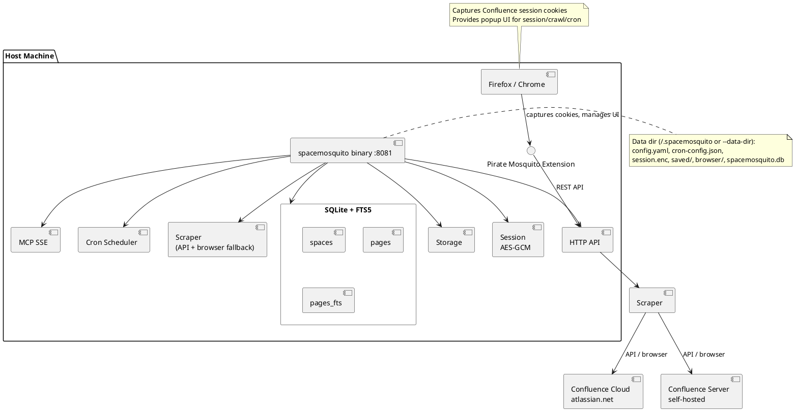

# SpaceMosquito Architecture

SpaceMosquito is a Confluence space scraper, indexer, and search engine with
automated cron scheduling. It uses Confluence REST API for content extraction
(with headless browser fallback), stores pages locally in **SQLite + FTS5**,
and indexes content for BM25/lexical search. It exposes an MCP server for LLM
integration, plus Firefox/Chrome browser extensions for session management
and crawl control.

Docker / PostgreSQL are not part of the runtime. See
[`DOCS/task-remove-docker-mode.md`](DOCS/task-remove-docker-mode.md).

## System Components



> **Rendering**: Use the PlantUML VS Code extension, `plantuml` CLI, or
> [plantuml.com/plantuml](https://www.plantuml.com/plantuml).

## Entry Points

### `cmd/spacemosquito`

Primary CLI + server binary: `init`, `serve`, `crawl`, `search`, `get-page`,
`reindex`, `stats`, bootstrap, cron helpers.

### `cmd/server` / `cmd/cli`

Thin aliases kept for compatibility; prefer `cmd/spacemosquito`.

## Internal Packages

| Package | Responsibility |
|---------|----------------|
| `api` | HTTP handlers — session, search, crawl, cron, spaces, MCP routing |
| `app` | Shared initialization — config, DB, storage, session |
| `config` | YAML config loading with JSON per-space cron overrides |
| `cron` | gocron/v2 scheduler — full/incremental crawl jobs |
| `datastore` | Open/migrate SQLite only |
| `store` | Store interface + models |
| `store/sqlite` | SQLite + FTS5 implementation |
| `mcp` | MCP SSE — JSON-RPC tools for search, pages, spaces |
| `scraper` | Confluence REST API (primary) + go-rod browser (fallback) |
| `session` | Cookie capture/management, Cloud vs Server flavor detection |
| `storage` | File system — HTML, Markdown, assets, metadata per space/page |
| `search` | Public search/page DTOs and excerpt helpers |
| `contentmd` | HTML → Markdown for `pages.content` / `content.md` |
| `paths` | Data-dir resolvers (`~/.spacemosquito`, env, `--data-dir`) |

## Data Flow

### Session Capture

```
Browser (Confluence page)
  → cookies.getAll() (extension background)
  → POST /api/session
  → AES-256-GCM encryption
  → session.enc under the data directory
```

- Flavor auto-detected during validation (Cloud vs Server/DC)
- Flavor stored in session, used for API URL construction

### Crawl Job

```
Extension / CLI / MCP
  → crawl job manager
  → discoverSpace() (API first, browser sidebar fallback)
  → for each page: ScrapePageAPI() or ScrapePage() fallback
  → HTML→Markdown via contentmd
  → UpsertPage() into SQLite + FTS5; files under saved/{space}/{page}/
```

### Search

```
Query → SQLite FTS5 (AND multi-word, BM25 with title boost)
     → optional title-substring fallback when FTS returns 0 rows
```

## Database Schema (logical)

**spaces** — tracked Confluence spaces (`key`, `name`, `url`, `last_crawled`, …)

**pages** — crawled pages (`confluence_id`, `title`, `content` Markdown, paths, …)

**pages_fts** — FTS5 virtual table over title + content

Migrations live in `space-mosquito/migrations/sqlite/` (also embedded in release builds).

## Scraping Modes

1. **Confluence REST API** (default) — Cloud and Server/DC URL shapes
2. **Headless browser** (fallback) — go-rod / Chromium on demand when API fails

## Security

- Session: AES-256-GCM, 32-byte key from `config.yaml`, file mode `0600`
- Cookies: captured via browser cookies API; SameSite=None for Atlassian
- HTTP API: no auth in MVP — intended for local use / reverse proxy

## Technology Decisions

### SQLite + FTS5

- Single-binary distribution; no separate database service
- FTS5 with Porter stemming; BM25 ranking with title weighting
- Vector/semantic search deferred

### Dual-mode scraper (API + browser)

- REST API is primary; go-rod only on failure / discovery fallback
- Browser launched on demand, not at every server start

### File-based session storage

- Simple and portable under the data directory

## Deployment

Local binary only. Data directory layout:

| Path | Purpose |
|------|---------|
| `config.yaml` | Runtime config |
| `spacemosquito.db` | SQLite database |
| `session.enc` | Encrypted cookies |
| `saved/` | Crawled pages + assets |
| `browser/` | Optional rod Chromium cache |
| `cron-config.json` | Per-space cron overrides |

Extensions run on the host and talk to `http://localhost:8081`.

## Known Limitations

1. No vector embeddings — BM25/lexical only (deferred)
2. No API auth — local/dev use behind reverse proxy
3. Session expiry — cookies expire; must re-capture
4. Confluence CSP blocks content-script injection
5. In-memory crawl jobs — not persisted across restarts
6. Single browser instance per job for fallback scrapes
