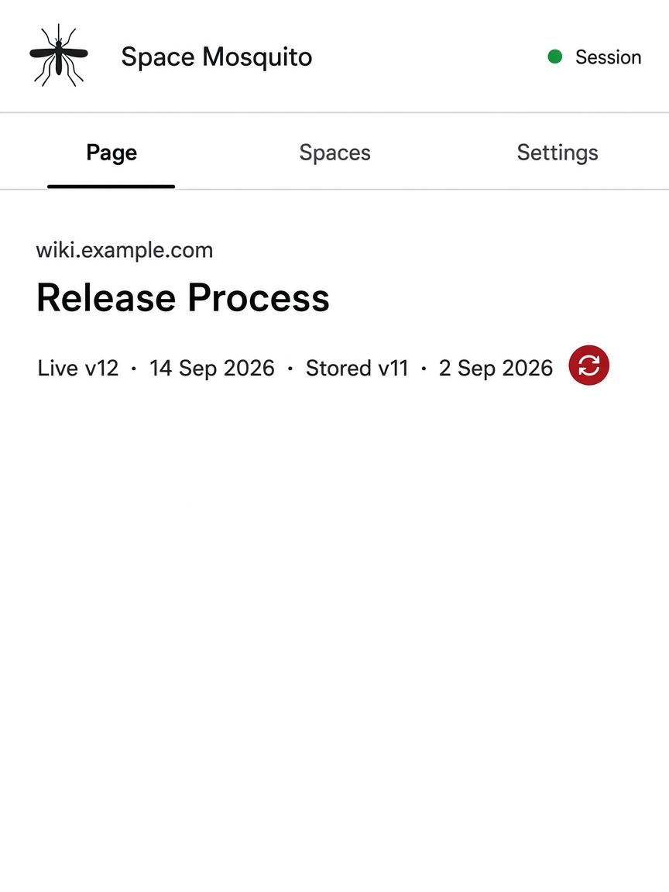
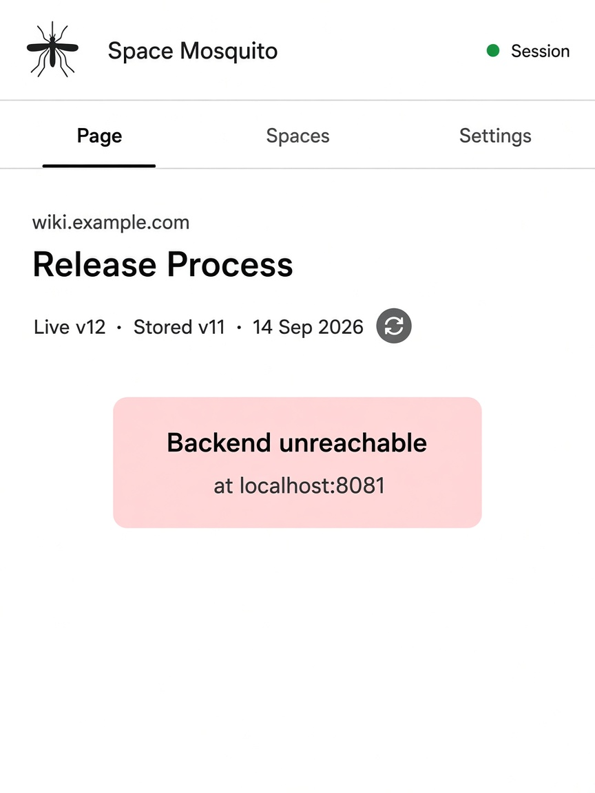
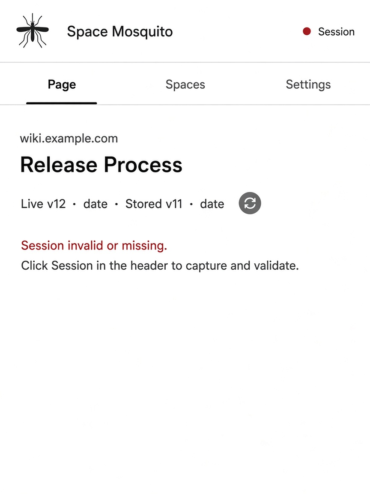
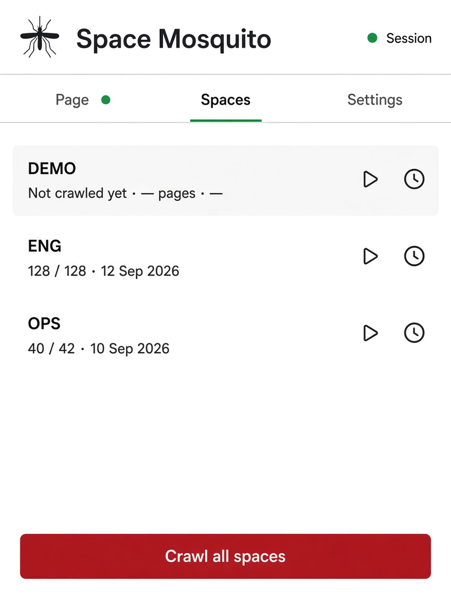
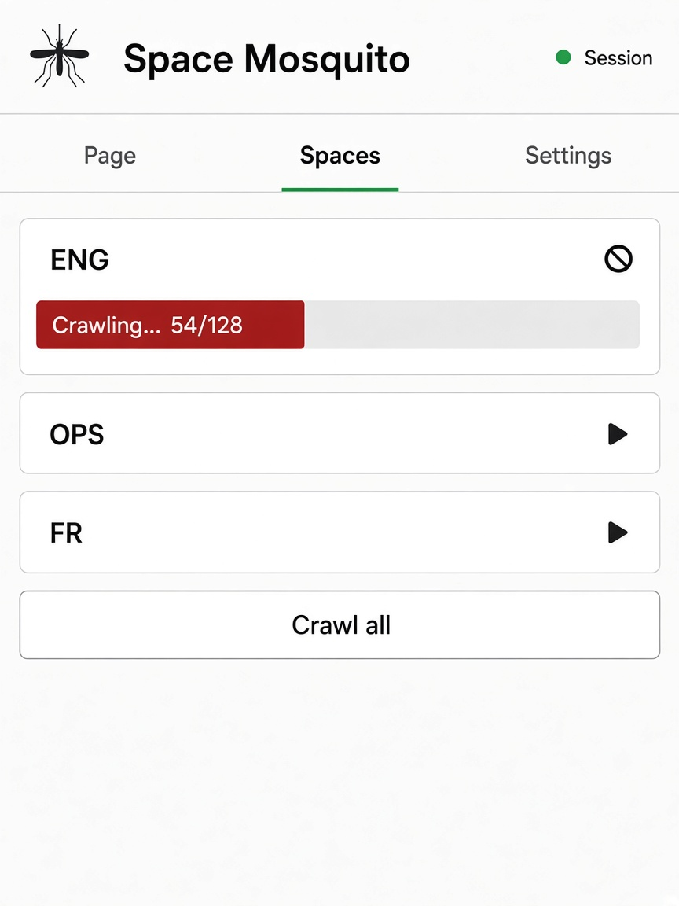
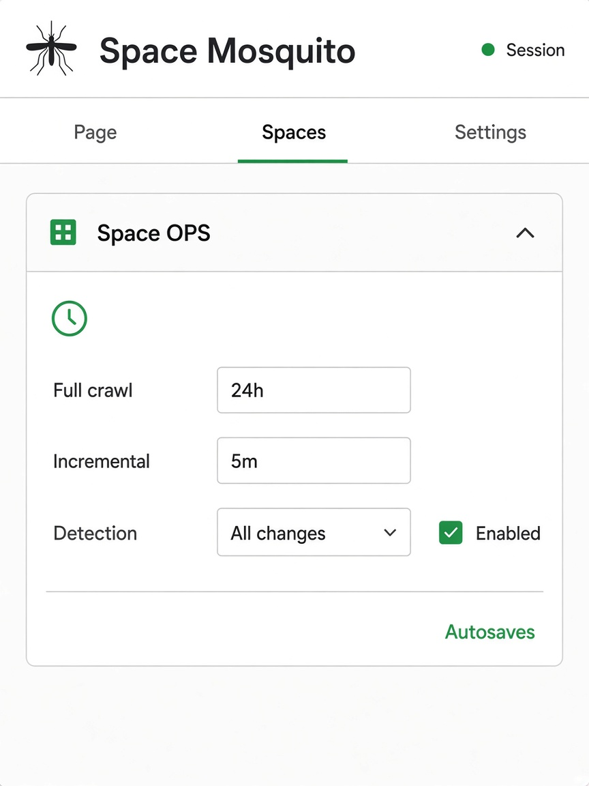
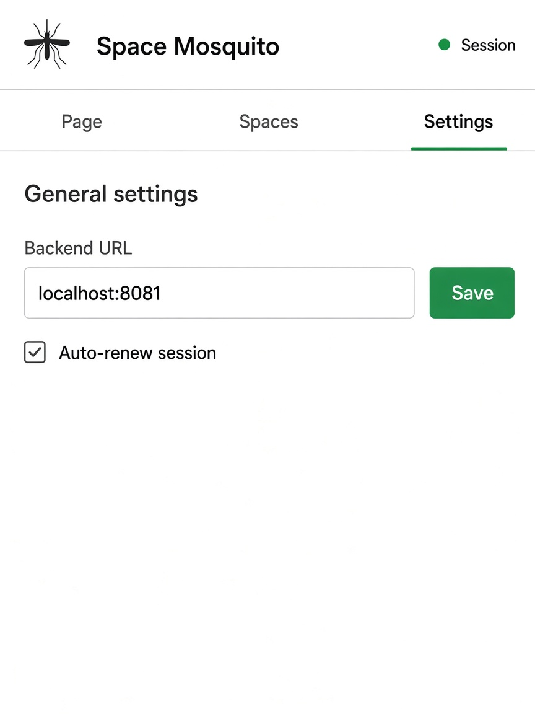

# Wireframes — Space Mosquito extension (v1, revision 3)

Artifacts for [`extension-redesign-mockups`](../extension-redesign-mockups.md).
Popup only. Catalog omitted.

## Information architecture

### Header (all tabs)

| Element | Behavior |
|---------|----------|
| Logo | Product mosquito icon (consistent across screens) |
| **Space Mosquito** | Modest title (not hero-sized) |
| **Session** disc + short label | Green = valid; red = invalid / missing. Tooltip: **Session is valid** / **Session is invalid or missing**. **Click** → capture + validate (undiscovered affordance). No delete here. |

**No Backend status in the header.** When the backend is down, a dialog/banner in the content area is enough; healthy backend needs no UI chrome.

### Tabs

**Page · Spaces · Settings**

| Tab | Purpose |
|-----|---------|
| **Page** | Current Confluence page context: host, title, live vs stored version/date, refresh one page |
| **Spaces** | Space list + inline crawl progress + inline cron (autosave); crawl-all at bottom |
| **Settings** | General app settings (backend URL, auto-renew, etc.) |

**Gating:** backend down → show banner; disable crawl / refresh / other API actions; Settings (backend URL) still reachable. Session red → disable refresh page and space crawls; **Page** tab shows “Session is invalid or missing [Refresh]”; Session disc click still works.

### Backend reachability (no click-to-recheck)

| When | Behavior |
|------|----------|
| Popup **open** (visible) | Poll backend every **2s**; on recovery, clear banner and re-enable actions |
| Popup **closed** / user clicked away | **No** backend polling |

**Feasibility:** trivial for the toolbar popup. Popup scripts run only while the popup DOM is alive; `setInterval` stops when the user dismisses it. No separate visibility API or background alarm needed for this rule. (Same pattern as existing crawl polling in `popup.ts`.)

---

## Screen 1 — Page (healthy)



```
┌──────────────────────────────────────────┐
│ 🦟  Space Mosquito           ● Session   │
├──────────┬──────────┬────────────────────┤
│ Page     │ Spaces   │ Settings           │
├──────────────────────────────────────────┤
│ wiki.example.com                         │  ← host, smaller
│ Release Process                          │  ← page title
│ v12 (Stored: v11)                     ↻  │  ← or “v12 (Up to date)” + sync
└──────────────────────────────────────────┘
```

Refresh = circular **sync** icon button (dark red), same row as the version line.

---

## Screen 2 — Backend down



```
┌──────────────────────────────────────────┐
│ 🦟  Space Mosquito           ● Session   │  (no Backend chip)
├──────────┬──────────┬────────────────────┤
│ Page     │ Spaces   │ Settings           │  ← 3 tabs only
├──────────────────────────────────────────┤
│ wiki.example.com                         │
│ Release Process                          │
│ Live … · Stored …                   ↻    │  sync disabled
│                                          │
│ ┌──────────────────────────────────────┐ │
│ │ Backend unreachable                  │ │
│ │ at localhost:8081                    │ │
│ └──────────────────────────────────────┘ │
│                                          │
│ Poll every 2s while popup open           │
│ (no click-to-recheck)                    │
└──────────────────────────────────────────┘
```

---

## Screen 3 — Session invalid



```
┌──────────────────────────────────────────┐
│ 🦟  Space Mosquito           ● Session   │  Session disc red
├──────────┬──────────┬────────────────────┤
│ Page     │ Spaces   │ Settings           │
├──────────────────────────────────────────┤
│ wiki.example.com                         │
│ Release Process                          │
│ Live … · Stored …                   ↻    │  sync disabled
│                                          │
│ Session is invalid or missing [Refresh]  │  Refresh = capture+validate
└──────────────────────────────────────────┘
```

Header Session disc tooltip: **Session is valid** / **Session is invalid or missing**. Disc click still works; Page tab does not point users at it.
---

## Screen 4 — Spaces list (compact)



```
┌──────────────────────────────────────────┐
│ …                              ● Session │
├──────────┬──────────┬────────────────────┤
│ Page     │ Spaces   │ Settings           │
├──────────────────────────────────────────┤
│ ▌ DEMO          — / — · —        ▶  ⏱  │  ← current, highlighted
│   Not crawled yet                        │     (may be empty)
│ ENG       128 / 128 · 12 Sep     ▶  ⏱  │  ← alpha after current
│ OPS        40 / 42 · 10 Sep      ▶  ⏱  │
│                                          │
│ [         Crawl all spaces        ]      │
└──────────────────────────────────────────┘
```

Compact row: **Name** (tooltip = full space URL) · **crawled/total** (last-run cache) · **last crawl date** (browser locale; tooltip = full date+time) · **play** (crawl) · **clock** (cron).

---

## Screen 5 — Spaces, crawl expanded



```
┌──────────────────────────────────────────┐
│ …                                        │
├──────────┬ Spaces ┬──────────────────────┤
├──────────────────────────────────────────┤
│ ENG       54 / 128 · …           ⏹  ⏱  │  play → stop
│ ▓▓▓▓▓▓▓▓░░░░  dark-red bar  42%         │
│ Crawling…                                │
│ OPS       …                      ▶  ⏱  │
│ [         Crawl all spaces        ]      │
└──────────────────────────────────────────┘
```

Cancel (stop) collapses the expanded progress and returns the row to compact. Multiple spaces may crawl in parallel (each expanded independently). Progress bar color: **dark red** (brand).

---

## Screen 6 — Spaces, cron expanded



```
┌──────────────────────────────────────────┐
│ …                                        │
├──────────┬ Spaces ┬──────────────────────┤
├──────────────────────────────────────────┤
│ OPS       40 / 42 · 10 Sep       ▶  ⏱  │  clock toggles panel
│ ┌ cron (autosave) ─────────────────────┐ │
│ │ Full crawl     [ 24h      ▾ ]        │ │
│ │ Incremental    [ 2h       ▾ ]        │ │
│ │ Detection      [ api      ▾ ]        │ │
│ │ ☑ Enabled                            │ │
│ └──────────────────────────────────────┘ │
└──────────────────────────────────────────┘
```

Cron panel is **independent** of crawl expand. Changes **autosave** (no Save button).

---

## Screen 7 — Settings



```
┌──────────────────────────────────────────┐
│ …                              ● Session │
├──────────┬──────────┬ Settings ──────────┤
├──────────────────────────────────────────┤
│ Backend URL                              │
│ [ http://localhost:8081      ] [Save]    │
│                                          │
│ ☐ Auto-renew session when a matching     │
│   Confluence tab is open                 │
│                                          │
│ (other general settings as needed)       │
└──────────────────────────────────────────┘
```

---

## Out of scope (v1)

- Catalog / search tab
- Separate Activity tab (progress lives on Spaces)
- Delete session from header (Settings may offer delete later)
- Chrome Side Panel
- Backend status chip / click-to-recheck in the header
