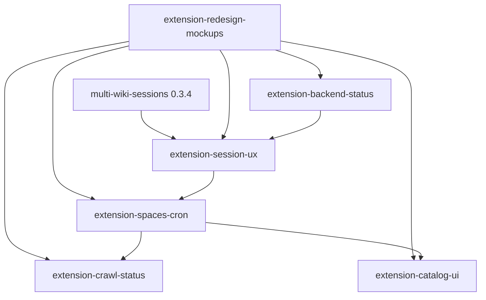

# Extension redesign (epic)

- **Task ID:** `extension-redesign`
- **Status:** backlog
- **Blocked by:** — (multi-wiki sessions shipped in 0.3.4; mockups first)
- **Children:**
  1. [`extension-redesign-mockups`](extension-redesign-mockups.md) — wireframes / mockups first
  2. [`extension-session-ux`](extension-session-ux.md) — capture+validate, session mgmt, validity gating, auto-renew
  3. [`extension-backend-status`](extension-backend-status.md) — live backend reachability
  4. [`extension-spaces-cron`](extension-spaces-cron.md) — spaces list + cron indicators + actions
  5. [`extension-crawl-status`](extension-crawl-status.md) — multi-space crawl progress
  6. [`extension-catalog-ui`](extension-catalog-ui.md) — search / get page / page list (optional phase)

## Goal

Redesign the Firefox and Chrome extensions into a coherent control surface:
session management, backend health, spaces/cron, crawl status, and (optionally)
catalog tools — with UI that disables itself when actions cannot succeed.

Assume **multi-wiki sessions** already exist: popup/session UI must show and
operate on **per-site** sessions, not a single global jar.

## Locked decisions (epic-level)

| # | Topic | Status | Decision |
|---|--------|--------|----------|
| 1 | Code sharing | locked | Keep **Chrome/Firefox duplicates** (same as self-hosted epic) — no `shared/` package in v1 |
| 2 | Multi-wiki | locked | Redesign builds **on** multi-wiki sessions (0.3.4 / ADR-002); do not re-introduce single-session UX |
| 3 | Mockups before code | locked | Land [`extension-redesign-mockups`](extension-redesign-mockups.md) and lock IA/screens before large UI implementation |

## Open decisions (lock in mockups / children)

| # | Topic | Status | Decision |
|---|--------|--------|----------|
| 4 | Validity check | open | How often / when: popup-open only; background poll (e.g. 1 min); on focus; or hybrid. Cost: hits Confluence with stored cookies. |
| 5 | Auto-renew | open | Checkbox “keep session fresh”: silent re-capture from matching open tab when invalid/near-expiry? Opt-in only? |
| 6 | Shell layout | open | Keep 3 tabs vs new IA (e.g. Status / Spaces / Catalog / Settings). Popup vs Chrome Side Panel. |
| 7 | Catalog in extension | open | In-popup search/list vs deep-link to local web UI / MCP-only. May defer whole child. |
| 8 | Parallel crawls UX | open | Single progress vs list of active jobs; cancel one vs all. |

## Wishes → children

| Wish | Child |
|------|--------|
| Capture + validate in **one** button | [`extension-session-ux`](extension-session-ux.md) |
| Gray-out when session invalid | [`extension-session-ux`](extension-session-ux.md) (+ backend gate) |
| Auto-renew checkbox | [`extension-session-ux`](extension-session-ux.md) |
| Rethink / redesign UI | [`extension-redesign-mockups`](extension-redesign-mockups.md) then all children |
| Session: capture, delete, info, status | [`extension-session-ux`](extension-session-ux.md) |
| Backend available/unavailable (live; fix bugs) | [`extension-backend-status`](extension-backend-status.md) |
| Disable UI when action impossible | session + backend children (shared gating rules) |
| Spaces list + actions; show cron on/off | [`extension-spaces-cron`](extension-spaces-cron.md) |
| Search / get page / page listing | [`extension-catalog-ui`](extension-catalog-ui.md) |
| Crawl status; parallel spaces | [`extension-crawl-status`](extension-crawl-status.md) |

## Suggested order

Mockups first. Multi-wiki sessions already shipped.

## Mockups before implementation

See [`extension-redesign-mockups`](extension-redesign-mockups.md). Short options:

| Approach | Pros | Cons |
|----------|------|------|
| **Wireframes in the mockups task** (Mermaid + ASCII / markdown screens) | Lives in-repo; agents can implement from it | Low visual fidelity |
| **Static HTML/CSS mock** under `dev/tasks/extension-redesign-mockups/` | Closest to real popup size; clickable tabs | Extra files to delete on cleanup or promote |
| **Figma / Penpot / Excalidraw** | Fast visual iteration | Link out; export PNG into task folder for agents |
| **Cursor Canvas** (if available) | Interactive exploration | Not always the source of truth for shipping |

**Recommendation:** lock **information architecture + 4–5 key screens** as markdown + exported PNG (or a single static HTML mock) in the mockups child; then implement. Do not start large CSS/TS rewrites until those screens are approved.

## Epic done when

- [ ] Mockups locked and children implemented (catalog child may stay deferred/cancelled)
- [ ] Capture+validate is one primary action; session list/info/delete work with multi-wiki
- [ ] Backend + session invalid states disable dependent controls
- [ ] Spaces show cron enablement; crawl status supports concurrent jobs
- [ ] Firefox and Chrome both updated (duplicated)
- [ ] CHANGELOG user-facing notes; cleanup deletes finished child task docs

## Non-goals (epic)

- Merging Chrome/Firefox into a shared package
- Replacing the local HTTP API with a different transport
- Full Confluence editor / write-back from the extension
