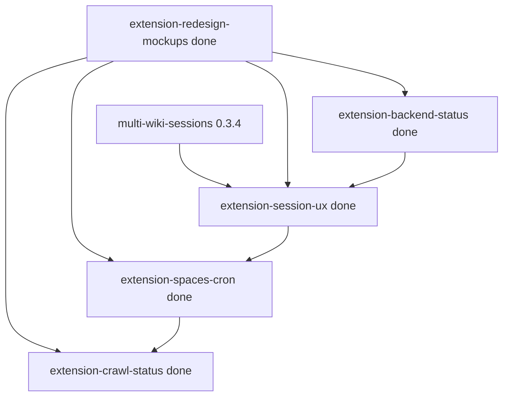

# Extension redesign (epic)

- **Task ID:** `extension-redesign`
- **Status:** done
- **Blocked by:** — (multi-wiki sessions shipped in 0.3.4; mockups first)
- **Children:**
  1. [`extension-redesign-mockups`](extension-redesign-mockups.md) — wireframes / mockups first
  2. [`extension-session-ux`](extension-session-ux.md) — capture+validate, session mgmt, validity gating, auto-renew
  3. [`extension-backend-status`](extension-backend-status.md) — live backend reachability
  4. [`extension-spaces-cron`](extension-spaces-cron.md) — spaces list + cron indicators + actions
  5. [`extension-crawl-status`](extension-crawl-status.md) — multi-space crawl progress
  6. ~~[`extension-catalog-ui`](extension-catalog-ui.md)~~ — **cancelled** (omitted from v1 mockups)

## Goal

Redesign the Firefox and Chrome extensions into a coherent control surface:
session management, backend health, spaces/cron, crawl status, and (optionally)
catalog tools — with UI that disables itself when actions cannot succeed.

Assume **multi-wiki sessions** already exist: popup/session UI must show and
operate on **per-site** sessions, not a single global jar.

## Locked decisions (epic-level)

| # | Topic | Status | Decision |
|---|--------|--------|----------|
| 1 | Code sharing | locked | Keep **Chrome/Firefox duplicates** (same as self-hosted epic) — no `shared/` package in v1 |
| 2 | Multi-wiki | locked | Redesign builds **on** multi-wiki sessions (0.3.4 / ADR-002); do not re-introduce single-session UX |
| 3 | Mockups before code | locked | Land [`extension-redesign-mockups`](extension-redesign-mockups.md) and lock IA/screens before large UI implementation |
| 4 | Validity check | locked | On popup open + Session disc click (capture+validate); optional Settings auto-renew while matching Confluence tab open |
| 5 | Auto-renew | locked | Opt-in **Auto-renew session** in Settings ([`extension-session-ux`](extension-session-ux.md)) |
| 6 | Shell layout | locked | **Page · Spaces · Settings**; header **Session** disc only (click = capture+validate). No Backend chip. Popup only. |
| 7 | Catalog in extension | locked | **Omit** from v1 — [`extension-catalog-ui`](extension-catalog-ui.md) cancelled |
| 8 | Parallel crawls UX | locked | Inline on **Spaces** rows (expand + dark-red progress + stop); multiple spaces may crawl at once |
| 9 | Backend probe | locked | Banner when down; poll every **2s while popup open**; **no** poll when closed; no click-to-recheck |

## Mockups

Locked artifacts: [`extension-redesign-mockups/WIREFRAMES.md`](extension-redesign-mockups/WIREFRAMES.md) (+ PNGs).

## Acceptance scenarios

Each implementation child has **Given / When / Then** scenarios. Put user intent in Given/When; put routes/helpers in Then. Tag **`[needs-api]`** when a new or changed backend is required before that Then can pass — implement those APIs first (no stubs); UI may degrade until then.

### `needs-api` index

| Tag | Child | Scenario | Status |
|-----|--------|----------|--------|
| `[needs-api]` | session-ux | **S6** Live version/date | **Done** — `GET /api/pages/{id}/compare` |
| `[needs-api]` | session-ux | **S7** One-page refresh | **Done** — `POST /api/pages/{id}/refresh` |
| `[needs-api]` | spaces-cron | **Z5** Idle crawled/total | **Done** — `pages_total` on spaces + `GET /api/spaces` |

## Wishes → children

| Wish | Child |
|------|--------|
| Capture + validate in **one** action | Header **Session** disc click ([`extension-session-ux`](extension-session-ux.md)) |
| Gray-out when session invalid | Session disc red + gated Page/Spaces actions |
| Auto-renew checkbox | Settings ([`extension-session-ux`](extension-session-ux.md)) |
| Rethink / redesign UI | [`extension-redesign-mockups`](extension-redesign-mockups.md) (rev 3) |
| Session status (no delete in header) | Header Session disc |
| Backend available/unavailable (live) | Content banner + 2s popup poll ([`extension-backend-status`](extension-backend-status.md)) |
| Disable UI when action impossible | session + backend gating |
| Spaces list + cron + crawl progress | [`extension-spaces-cron`](extension-spaces-cron.md) + [`extension-crawl-status`](extension-crawl-status.md) (inline) |
| Search / get page / page listing | ~~catalog~~ cancelled for v1 |
| Single-page refresh + live/stored | Page tab scenarios **S5–S7** in [`extension-session-ux`](extension-session-ux.md) |

## Suggested order

Epic done after smoke on public Confluence + polish. Further bugs → separate follow-up tasks. **Do not delete task docs until cleanup/release.**

## Epic done when

- [x] Mockups locked (catalog cancelled for v1)
- [x] Capture+validate is one primary action; session gating + Page tab (live/stored/refresh)
- [x] Backend invalid state disables dependent controls (banner + 2s poll)
- [x] Spaces show cron enablement; crawl status supports concurrent jobs
- [x] Firefox and Chrome both updated (duplicated)
- [x] CHANGELOG user-facing notes under `[Unreleased]` (cleanup of child task docs deferred)

## Non-goals (epic)

- Merging Chrome/Firefox into a shared package
- Replacing the local HTTP API with a different transport
- Full Confluence editor / write-back from the extension
