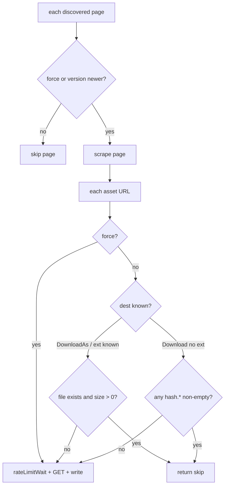

# Task: Skip already-downloaded assets (+ `--force` to override)

## Problem

Asset downloading re-fetches files that are already on disk, and the one skip
that exists doesn't actually save anything.

- **`DownloadAs`** (the CSF path — all images and draw.io diagrams) has **no
  skip at all** ([asset.go](../../spacemosquito/internal/storage/asset.go)). Every
  crawl re-fetches and **overwrites** every asset via `os.Create` (truncate).
- **`Download`** (legacy ``/`<a href>` path) *does* skip, but the
  `os.Stat` check runs **after** the HTTP GET and the ≥5s rate-limit wait
  ([asset.go:157](../../spacemosquito/internal/storage/asset.go#L157)) — so it only
  avoids the final disk write, not the network request or the wait.

At ≥5s per asset (shared, serial rate limit), re-crawling a space with hundreds
of images takes many minutes of pure waiting on files we already have. Nothing
higher up (scraper / DB / metadata) checks "already downloaded" either.

**Hot path today:** API/CSF crawl → `downloadCSFAssets` → `DownloadAs`. Legacy
browser HTML → `processImages` / `processAttachments` → `Download`. Fix both;
CSF is what matters for normal Cloud crawls.

## Goal

1. **Skip an asset when the destination file already exists — *before* the
   network request** (save both the GET and the 5s rate-limit wait).
2. Add **`crawl --force`** that **re-scrapes every page and re-downloads every
   asset** — bypasses both the unchanged-page version skip and the asset
   existence skip.

Default crawl: unchanged pages skipped; existing non-empty assets skipped.
`--force`: every page scraped again; every asset re-fetched and overwritten.

## Implementation solution

### 1. `AssetDownloader` ([internal/storage/asset.go](../../spacemosquito/internal/storage/asset.go))

Add force flag (set once per crawl; same mutex pattern as `SetAuthHeaders`):

```go
type AssetDownloader struct {
    // ...existing fields...
    force bool
}

func (d *AssetDownloader) SetForce(force bool) {
    d.mu.Lock()
    d.force = force
    d.mu.Unlock()
}

func (d *AssetDownloader) shouldSkip(path string) bool {
    d.mu.Lock()
    force := d.force
    d.mu.Unlock()
    if force {
        return false
    }
    fi, err := os.Stat(path)
    return err == nil && fi.Size() > 0
}
```

**`DownloadAs(destPath, rawURL)`** — check at the very top, before
`rateLimitWait()` / `get()`:

```go
if d.shouldSkip(destPath) {
    // debug log: already exists, skipping
    return nil
}
// …existing retry / GET / write…
```

**`Download(destDir, rawURL)`** — resolve candidate path(s) *before* the GET:

1. `hash := sha256(rawURL)[:8]` (same as today).
2. `ext := filepath.Ext(rawURL)` (path segment only; query string is fine —
   `filepath.Ext` on a full URL with `?` is awkward; use `url.Parse` +
   `filepath.Ext(parsed.Path)` so `…/img.png?width=…` still counts as having
   an extension).
3. If `ext != ""`: `destPath = join(destDir, hash+ext)`; if `shouldSkip(destPath)`
   return that path.
4. If `ext == ""`: **hash-prefix glob** — look for any non-empty file matching
   `hash.*` under `destDir` (e.g. `filepath.Glob(join(destDir, fmt.Sprintf("%x.*", hash)))`).
   If any match has size > 0, return that path and skip the GET.
5. Only then enter the existing retry loop (`rateLimitWait` → `get` → write).
6. **Remove** the post-GET `os.Stat` skip (lines ~157–165): it no longer helps
   once the pre-GET check exists, and under `--force` it would incorrectly skip
   the overwrite.

Helper (private):

```go
func existingByHashPrefix(destDir string, hash [8]byte) (string, bool)
```

If multiple matches exist (rare: old `.bin` + later `.png`), pick the first
non-empty; do not download.

### 2. CLI ([internal/cliapp/run.go](../../spacemosquito/internal/cliapp/run.go))

Today `crawl` takes a bare positional URL and ignores flags:

```go
case "crawl":
    runCrawl(cfg, args[2], log)  // no FlagSet
```

Change to a `flag.FlagSet` (same style as `init` / `bootstrap import-saved`):

```text
usage: spacemosquito crawl [--force] <space-url>
```

- Parse `--force` before the URL.
- Pass force into the crawl: set both scraper and downloader (see §3).
- Help text: *re-scrape all pages and re-download all assets, ignoring
  version and on-disk skips*.

Wire **CLI only** in v1. Server job manager / cron stay on default
`force=false`.

### 3. Scraper — page force ([internal/scraper/scraper.go](../../spacemosquito/internal/scraper/scraper.go))

Today unchanged pages are skipped here (~L228–239):

```go
if pg.Version > 0 {
    existingPage, err := s.db.GetPage(...)
    if err == nil && existingPage.Version >= pg.Version {
        // skip — never reaches downloadCSFAssets
        continue
    }
}
```

**Decided:** `--force` bypasses this skip so every page is scraped and every
asset path runs.

Implementation:

- Add `force bool` on `Scraper` (or an arg on `CrawlSpace`). Prefer a field +
  `SetForce(bool)` (or set at construction in `runCrawl`) so API/cron stay
  untouched.
- In the version check: `if !s.force && existingPage.Version >= pg.Version { … continue }`.
- In `runCrawl`: `assetDownloader.SetForce(force)` **and** `s.SetForce(force)`
  (or equivalent) before `CrawlSpace`.

Asset skip still lives in the downloader; page skip lives in the scraper.
Both must see the same flag.

Optional polish: debug log when skipping an asset; no new crawl summary
counters required.

### 4. Tests

**Downloader** ([asset_test.go](../../spacemosquito/internal/storage/asset_test.go)):

| Case | Assert |
|------|--------|
| `DownloadAs` existing size>0, `force=false` | handler **never** hit; returns nil |
| `DownloadAs` missing | downloads once |
| `DownloadAs` zero-byte existing | re-downloads |
| `DownloadAs` existing + `SetForce(true)` | handler hit; file overwritten |
| `Download` URL with ext, file present | no GET |
| `Download` extensionless URL, `hash.jpg` present | no GET; returns that path |
| Existing `Download_skipsExisting` | still green; prove **no second GET** |

**Scraper / crawl force** (unit or small integration as fits existing tests):

| Case | Assert |
|------|--------|
| `force=false`, DB version ≥ discovered | page not scraped |
| `force=true`, same versions | page scraped anyway |

Use a request counter on `httptest` handlers for “no GET” proofs. Keep
`rateLimit: 0` in `testDownloader`.

### 5. Docs / UX

- Update CLI usage / README crawl example.
- `--force` help: *re-scrape all pages and re-download all assets*.

## Flow



## Integration points

| Area | Change |
|------|--------|
| `internal/storage/asset.go` | `force`, `SetForce`, `shouldSkip`, pre-GET skip, hash glob, drop post-GET skip |
| `internal/storage/asset_test.go` | skip / force / zero-byte / no-GET assertions |
| `internal/scraper/scraper.go` | `force` bypasses unchanged-page version skip |
| `internal/cliapp/run.go` | `crawl [--force] <url>` → scraper + downloader `SetForce` |
| reindex / import | **unchanged** |

## Non-goals

- Content-hash / ETag / Last-Modified freshness.
- Detecting remote asset changes when the local filename is unchanged (use `--force`).
- `--force` on server/API/cron crawl paths.
- Magic-byte / HTML-sniff validation of existing files on skip.
- Auto-repair of legacy HTML-as-`.png` files without `--force`.

## Decisions

- **`crawl --force` = full refresh:** bypass unchanged-page version skip **and**
  asset existence skip (re-scrape all pages + re-download all assets).
- **`Download` extensionless skip:** hash-prefix glob (`sha256(url)[:8].*`)
  before GET — same “no network / no rate-limit wait” win as named files.
  (Alternative was post-GET-only skip for those URLs: still pays GET + wait,
  only avoids the write.)
- **URL extension:** `filepath.Ext(parsed.Path)` (not raw URL string). Fix
  `Download` and `RewriteURL` in the same PR.
- **Multiple `hash.*` matches:** return first non-empty Glob hit; warn if >1.
- **Server/API/cron force:** out of scope for v1 (CLI only).
- **Config.yaml:** no knob; CLI `--force` only.
- **Corrupt-file skip guard:** size > 0 only; no magic-byte sniff in this task.
