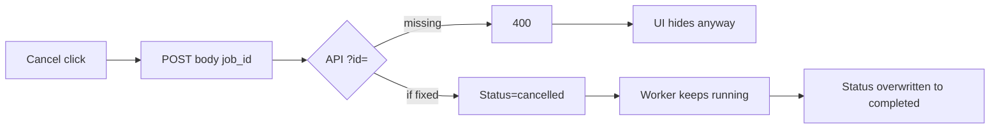

# Task: Make crawl Cancel actually stop the job

## Problem

The Crawl tab Cancel button does not stop a running crawl. Analysis (no code
changed yet):

1. **HTTP contract mismatch** — Firefox/Chrome `cancelCrawl` POSTs JSON
   `{ "job_id": "…" }` to `/api/crawl/cancel`. The handler only reads
   `?id=` ([crawl.go](../../spacemosquito/internal/api/crawl.go)). Cancel
   returns **400** (`id query parameter is required`).
2. **UI swallows failure** — background `handleCancelCrawl` catches errors and
   returns `{ success: false }` without throwing. Popup ignores that result and
   still hides progress / clears `active_job_id`, so Cancel looks successful.
3. **Cancel is status-only** — `CancelJob` sets `job.Status = cancelled` but
   does not cancel a context. Create starts the worker with
   `RunJob(context.Background(), …)` — nothing to cancel.
4. **Runner never cooperates** — `CrawlRunner.Run` only checks `ctx.Done()`
   between pages; it never reads `job.Status`. Work continues (including mid-
   page scrape / asset downloads until the next page boundary at best… and
   never, today, because ctx is never done).
5. **Finish overwrites cancel** — when `Run` returns, `RunJob` always sets
   `completed` or `failed`, wiping `cancelled`.



## Goal

1. Cancel request from the extension succeeds (stable HTTP contract).
2. A running job **stops** soon after cancel (between pages at minimum;
   in-flight page may finish).
3. Final job status stays **`cancelled`** (not completed/failed).
4. Popup only treats cancel as success when the API succeeded; on failure show
   an error and keep progress visible.

## Implementation solution

### 1. Cancel API — query only ([internal/api/crawl.go](../../spacemosquito/internal/api/crawl.go))

**One way to cancel** (breaking change OK per [DEVELOPMENT.md](../../docs/DEVELOPMENT.md)):

```http
POST /api/crawl/cancel?id=<job_id>
```

- Require query `id` (same as status). **Do not** accept JSON body `job_id`.
- Missing `id` → 400.

### 2. Fix both extensions

- [firefox-extension/lib/api.ts](../../firefox-extension/lib/api.ts) and
  [chrome-extension/lib/api.ts](../../chrome-extension/lib/api.ts):
  `POST /api/crawl/cancel?id=${encodeURIComponent(jobId)}` — **no body**.
- Popup cancel handlers: check `{ success }` (or throw from background on
  failure). On failure: `alert` / status text; **do not** hide progress or
  clear job id.
- Background may keep returning `{ success, error }` — popup must branch on it.

### 3. Cooperative cancel in the job manager
([internal/scraper/job.go](../../spacemosquito/internal/scraper/job.go))

Applies to jobs created via **`POST /api/crawl`** only (extension / API).
Cron and CLI are out of scope for this Cancel button.

- Per job, store a `context.CancelFunc` when `RunJob` starts:
  `ctx, cancel := context.WithCancel(parent)`; register `cancel` on the job
  (or a side map keyed by job ID).
- `CancelJob`:
  - **pending** — status → `cancelled` immediately (no special UX).
  - **running** — call `cancel()`, status → `cancelled`.
- `CrawlRunner.Run` page loop: honor `ctx.Done()` between pages (stop before
  the next page; mid-page scrape may finish).
- `RunJob` completion: **if status is already `cancelled`, do not overwrite**
  with completed/failed. If `errors.Is(err, context.Canceled)`, leave/ensure
  `cancelled` (not `failed`).
- Create handler: `context.Background()` + per-job `WithCancel` inside
  `RunJob` is enough.

### 4. UX / polling

Existing poll already understands `cancelled`. After successful cancel, status
poll should see `cancelled` and clear `active_crawl` as today. Idempotent
clear is fine. Pending cancel: same UI path as running (status `cancelled`).

## Testing — extend existing layers (no new layer)

**No new testing layer.** Cover with existing Go unit tests:

| Layer | File | Add |
|-------|------|-----|
| API | `internal/api/handler_test.go` (or `crawl_test.go`) | `?id=` → 200; missing id → 400; body alone must **not** cancel |
| Job manager | `internal/scraper/job_test.go` | Cancel pending; cancel running cancels context / loop exits; status stays `cancelled`; `RunJob` does not overwrite |
| Extensions | none | Manual smoke only — no new e2e/Playwright layer |

### Concrete Go tests to add

1. **`CancelJob` cancels context** — start a controllable run, call
   `CancelJob`, assert loop exits and status is `cancelled`.
2. **`RunJob` does not overwrite cancelled**.
3. **`Cancel` HTTP** — `POST /api/crawl/cancel?id=<id>` → 200; without query
   → 400 even if body has `job_id`.
4. Prefer in-package stubs (fake discover / scrape blocking on
   `<-ctx.Done()`). Do not add an extension test framework.

### Out of scope for tests

- Full extension popup automation.
- Aborting mid-page HTTP/asset download.

## Integration points

| Area | Change |
|------|--------|
| `internal/api/crawl.go` | Query `id` only |
| `internal/scraper/job.go` | Per-job cancel context; honor between pages; don’t overwrite status |
| `firefox-extension` / `chrome-extension` `lib/api.ts` | Query-param cancel, no body |
| popup cancel click handlers | Check success before clearing UI |
| `job_test.go` / API tests | Extend as above |

## Non-goals

- Cancel for CLI `spacemosquito crawl` (Ctrl-C).
- Cancel for cron-triggered crawls (not created via `/api/crawl`).
- Abort mid-page HTTP (v1 = between pages).
- Accept cancel id from JSON body.
- New e2e / extension test framework.

## Decisions

- **API:** `POST /api/crawl/cancel?id=…` only. No body `job_id`. Breaking
  change accepted ([DEVELOPMENT.md](../../docs/DEVELOPMENT.md)).
- **Stop granularity:** between pages; mid-page may finish.
- **Pending cancel:** immediate status flip; no special UX.
- **Scope:** jobs created via `/api/crawl` only (extension/API).
- **Testing:** extend existing Go unit tests; no new testing layer.
