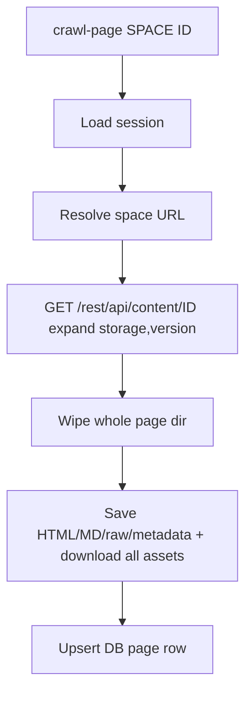

# Task: Crawl a single page by space + Confluence ID

## Problem

Space crawl (`spacemosquito crawl <space-url>`) is all-or-nothing: discover every
page, skip unchanged versions, skip existing assets (unless `--force`). There is
no way to refresh **one** known page.

CLI `save <url>` is a stub (writes placeholder metadata only — no fetch).

Operators who know `space_key` + `confluence_id` (from search, MCP, or the URL)
need a focused refresh that always replaces that page’s local text and assets.

## Goal

Add a command that:

1. Takes a **space identifier** and **Confluence page ID**.
2. Fetches that page via the existing API path (`ScrapePageAPI`).
3. **Always overwrites** local disk + DB content for that page — Markdown/HTML,
   metadata, and assets — **without** a `--force` flag (overwrite is the
   default and only behaviour).

Does not crawl sibling pages or the rest of the space.

## Proposed CLI

```text
spacemosquito crawl-page <space-key> <confluence-id>
```

Examples:

```sh
spacemosquito crawl-page PROJ 250347937
spacemosquito crawl-page TST 42
```

- `space-key` — Confluence space key (same as DB `spaces.key` / catalog).
- `confluence-id` — numeric page ID.

Reuse session loading like `crawl` (require captured session + encryption key).

**Not** a flag on `crawl` — keep space crawl and single-page refresh separate.

## Behaviour



### Always-refresh semantics

Unlike space `crawl`:

| Check | Space crawl (default) | `crawl-page` |
|-------|------------------------|--------------|
| Unchanged version skip | Yes | **No** — always scrape |
| Asset existence skip | Yes | **No** — always re-download / overwrite |
| `--force` flag | Optional full refresh | **N/A** — always full refresh for that page |

Implementation: call `assetDownloader.SetForce(true)` for this command only;
do not use the unchanged-page skip path.

### Overwrite strategy (local files)

`SaveHTML` / `SaveMarkdown` / `SaveRawHTML` / `SaveMetadata` already overwrite
files in place. Assets with `SetForce(true)` overwrite same paths.

**Stale assets / full replace:** wipe the **entire page directory contents**
(remove all files/subdirs under the destination `file_dir`, keep or recreate
the directory), then write fresh text + assets. Simple and leaves no orphans.

If the title changed and `MakePageDir` would pick a new path, prefer writing
into the **existing** `file_dir` when the DB row exists (avoid orphan dirs) —
until [`task-page-dir-collision`](task-page-dir-collision.md) lands ID-suffixed
dirs.

### Resolve space URL

1. `GetSpaceByKey(spaceKey)` → use `space.URL` if present.
2. Else derive from session: `{sess.ConfluenceURL}/wiki/spaces/{key}` (Cloud)
   or `{sess.ConfluenceURL}/spaces/{key}` (Server) — mirror discovery helpers.
3. Auto-create space row on success (same as `savePageMetadata` today) if
   missing.

Verify the API page’s space matches `space-key` when the content response
includes space info (fail if wrong space / 404).

### Scraper API

Add something like:

```go
func (s *Scraper) CrawlPage(spaceKey string, confluenceID int, sess *session.Session) error
```

- Build `Page{ConfluenceID, …}`; fetch title/version/ancestors from the content
  API (today `ScrapePageAPI` assumes title may already be set — ensure title/
  version are filled from the response).
- `SetForce(true)` on assets for this call.
- Reuse `ScrapePageAPI` + `savePageMetadata` (or a thin wrapper that clears
  dir first).

### Out of scope (v1)

- Extension / MCP / REST trigger for single-page crawl (CLI only; can follow).
- Replacing stub `save <url>` (separate cleanup).
- Space-wide crawl behaviour changes.
- Auto-migration of colliding title dirs (see page-dir-collision task).

## Integration points

| Area | Change |
|------|--------|
| `internal/cliapp/run.go` | `crawl-page <space-key> <id>` |
| `internal/scraper/scraper.go` | `CrawlPage`; ensure API fills title/version; optional dir wipe |
| `internal/storage` | Maybe `ClearPageDir(dir)` helper |
| README / usage | Document command |
| Tests | Unit/integration as below |

## Testing

- `CrawlPage` / save path: existing page dir + assets → after run, content
  updated; forced asset GET (handler hit) even when file existed.
- Wrong space / missing page → clear error, no partial silent success.
- DB `UpsertPage` updates version/title/content/`file_dir`.
- After wipe: no leftover files from the previous page snapshot under `file_dir`.

No new testing layer — extend scraper/cli tests; httptest for API + assets.

## Decisions

- Command name: `crawl-page <space-key> <confluence-id>` (not `save`, not a
  `crawl` flag).
- Space identifier: **space key only** for v1.
- Always overwrite text + assets; **no `--force`**.
- **Wipe whole page dir** contents before write (simple; no orphan assets).
- Reuse existing DB `file_dir` when the page row exists (title renames).
- CLI-only for v1; API/MCP later if needed.
- Not blocked on page-dir-collision; ID-suffixed dirs remain a separate improvement.
