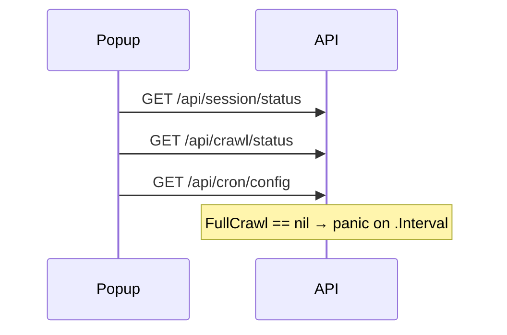

# Task: Panic on GET `/api/cron/config` when cron YAML blocks are nil

## Problem

Opening the Chrome extension popup crashes the backend with a nil pointer
dereference in `CronAPIHandler.ConfigGet`. Closing and reopening the popup
retriggers it. Switching tabs in the popup does **not** (only the open/`init`
path hits this endpoint).

Firefox not confirmed; same `loadCronConfig()` / `GET /api/cron/config` call
exists there, so the panic is almost certainly shared.

## Reproduction

1. Run `spacemosquito serve` with a config where `cron.full_crawl` and/or
   `cron.incremental` are omitted / null (common default).
2. Click the Chrome extension icon (popup opens).
3. Server panics; stack points at `internal/api/cron.go` ~line 65.

Preceding logs (healthy):

```text
GET /api/session/status → 200
GET /api/crawl/status → 200
```

Then panic in:

```text
CronAPIHandler.ConfigGet
  …/internal/api/cron.go:65
```

## Root cause

`ConfigGet` only nil-checks `FullCrawl` / `Incremental` for the `enabled`
field, then dereferences the pointers unconditionally:

```go
"enabled":  h.cfg.Cron.FullCrawl != nil && h.cfg.Cron.FullCrawl.Enabled,
"interval": h.cfg.Cron.FullCrawl.Interval, // panics when FullCrawl == nil
```

Same pattern for `yaml_incremental`.

Popup `init()` always awaits `loadCronConfig()` → `GET /api/cron/config`, so
every icon click hits the bug.



## Fix

In `ConfigGet` (and any similar response builders):

- If `FullCrawl` / `Incremental` is nil, emit safe defaults (e.g. `enabled:
  false`, empty `interval`/`spaces`/`max_duration`) — do not dereference.
- Prefer a small helper, e.g. `cronJobYAMLView(c *config.CronJobConfig) map[string]any`.

Optional hardening:

- Recover middleware is out of scope unless already desired; fixing the nil
  check is enough.
- Unit test: config with nil cron job pointers → `ConfigGet` returns 200 JSON,
  no panic.

## Out of scope

- Changing cron scheduler defaults / YAML schema.
- Firefox-only UI work (backend fix covers both extensions).

## Done when

- Popup open with nil cron YAML blocks returns 200 from `/api/cron/config`.
- No panic on repeated open/close of the extension icon.
- Test covers nil `FullCrawl` and nil `Incremental`.
