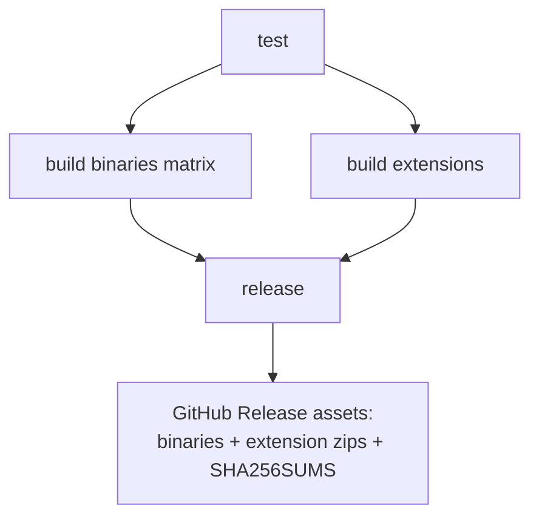

# Task: Attach browser extension zips to GitHub Releases

## Problem

GitHub Releases (tag `v*`, [`.github/workflows/release.yml`](../../.github/workflows/release.yml))
only publish `spacemosquito` binaries + `SHA256SUMS`. Users who want the
Firefox/Chrome extensions must clone the repo and run `npm install && npm run
build` locally.

## Goal

On every `v*` release, also publish **built extension packages** (zipped
`dist/` for Firefox and Chrome) as release assets alongside the binaries.

No store publishing, no auto-install into the browser — download + load
unpacked / temporary add-on as today.

## Implementation solution

### 1. Release workflow ([`.github/workflows/release.yml`](../../.github/workflows/release.yml))

Add a job (or steps on `release`) that:

1. `actions/setup-node` (pin Node LTS; cache npm).
2. Build both extensions with **`npm ci`**:
   ```sh
   cd firefox-extension && npm ci && npx webpack --mode production
   cd chrome-extension && npm ci && npx webpack --mode production
   ```
3. Zip each `dist/` **contents at archive root** (`manifest.json` top-level
   after unzip):
   - `spacemosquito-firefox-${VERSION}.zip`
   - `spacemosquito-chrome-${VERSION}.zip`
   where `VERSION` is `${{ github.ref_name }}` (e.g. `v0.1.0`).
4. Upload those zips into the same `softprops/action-gh-release` `files:` list
   (and include them in `SHA256SUMS`).

Extensions are **platform-independent** — one build each, not a GOOS matrix.



### 2. Version stamp (recommended in same PR)

Both manifests hardcode `"version": "0.1.0"`. On release, set
`manifest.json` `version` from the tag (strip leading `v` — browsers want
`X.Y.Z`).

Options: CI sed/jq before webpack, or a tiny pre-build script. Keep it boring.

### 3. Local `build-release.sh`

Extend [`spacemosquito/scripts/build-release.sh`](../../spacemosquito/scripts/build-release.sh)
(validated working for binaries) to also:

1. Build both extensions (`npm ci` + webpack) from the repo root.
2. Write the same zip names into the output dir (contents at root).
3. Include extension zips in `SHA256SUMS`.

### 4. Docs (done ahead of CI)

Install guides are split:

- [`docs/INSTALL.md`](../../docs/INSTALL.md) — release binary + extension zips
- [`docs/INSTALL-FROM-SOURCE.md`](../../docs/INSTALL-FROM-SOURCE.md) — Go/npm build

[`README.md`](../../README.md) links both. When implementing CI, only tweak
install wording if asset names differ; update [`dev/RELEASE.md`](../RELEASE.md)
checklist to confirm extension zips on the release page.

## Testing

No new test framework.

- Local: `./scripts/build-release.sh vX.Y.Z` produces binaries + both zips +
  checksums; unzip zips and confirm `manifest.json` at root.
- CI: tagged release attaches both zips.
- Smoke: load unzipped Chrome/Firefox packages in the browser.

## Integration points

| Area | Change |
|------|--------|
| `.github/workflows/release.yml` | Node + `npm ci` + zip (contents root) + release files |
| `spacemosquito/scripts/build-release.sh` | Also build/zip extensions |
| Manifests | Version from tag at build time |
| `dev/RELEASE.md` | Checklist for extension assets |
| `docs/INSTALL.md` / `INSTALL-FROM-SOURCE.md` | Already split; adjust if needed |

## Non-goals

- AMO / Chrome Web Store publish or signing.
- CLI that auto-installs into a running browser.
- Per-OS extension builds.

## Decisions

- **Option A:** ship zips on GitHub Release; manual load.
- **Zip layout:** contents of `dist/` at archive root.
- **CI deps:** `npm ci` (lockfiles present).
- **Local parity:** extend `build-release.sh` to build extension zips too.
- **Docs:** `docs/INSTALL.md` + `docs/INSTALL-FROM-SOURCE.md` (requirements
  live in each guide).
