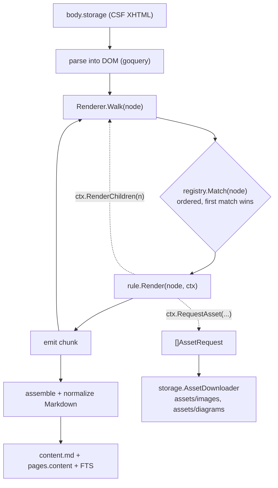

# CSF → Markdown converter

Rule-based converter for **Confluence Storage Format (CSF)** — the
`<ac:…>` / `<ri:…>` XHTML dialect returned by the REST API's `body.storage`.
It walks the CSF DOM and dispatches each node to a matching **rule** that emits
a clean Markdown chunk.

Goal is **"good enough"** Markdown (not 1:1 fidelity): preserve block structure
and readable text, drop macro-parameter noise, extract images/diagrams as asset
files. See [ADR-015](../../../../adr/015-saved-page-format-with-markdown.md) §v2
for the on-disk format decision this implements. This README covers the
rule-engine mechanics (in lieu of a separate ADR).

## Why this exists

The API path fetches `body.storage`, which is CSF, not rendered HTML. The
generic `html-to-markdown` converter has no knowledge of `ac:`/`ri:` tags, so
macro **parameters** leak as concatenated text (`1solid`, `Company-Jira…`) and
`<ac:image>` diagrams are silently dropped. This package understands CSF and
replaces the generic path for storage-format pages.

## Two input formats, one router

`raw.html` comes from two sources; a single **format sniff** routes each:

- **Storage format** (API `body.storage`) → this CSF converter.
- **Rendered HTML** (browser/rod fallback) → the existing generic converter,
  unchanged.

The sniff checks for `xmlns:ac` / `<ac:` / `<ri:`. There is **one** classifier,
not a rule-set per format — rendered HTML is well-formed and already converts
acceptably, and the macro-noise problem is CSF-specific.

## Architecture

## Package layout

Everything lives in the single `csf` package (idiomatic Go — one package per
directory). Rules are `rule_*.go` files in the same package so
`DefaultRegistry()` can reference them without an import cycle; the `rules/`
directory holds the [rule catalog doc](rules/README.md), not code.

| File | Responsibility |
|------|----------------|
| `converter.go` | Public entry: `CSFToMarkdown(storageXML, ctx) (string, []AssetRequest, error)` |
| `renderer.go` | DOM walk + chunk assembly + normalization (no length cap) |
| `registry.go` | Ordered rule registry (`Register` / `Match`) + `DefaultRegistry()` |
| `context.go` | `RenderContext`: pageID, baseURL, asset sink, `RenderChildren`; `AssetRequest` |
| `rule.go` | `Rule` interface + shared helpers (`tagName`) |
| `sniff.go` | `IsStorageFormat` — format detection (CSF vs rendered HTML) |
| `rule_*.go` | One rule per file (`rule_strip.go`, `rule_layout.go`, `rule_fallback.go`, …) — see [rules/README.md](rules/README.md) |

## Registry semantics

- **Ordered, first-match-wins.** Specific rules (e.g. `code` macro) register
  before generic ones (structured-macro fallback, HTML passthrough).
- **Fallback rule last.** Unknown `structured-macro` → render `rich-text-body`
  children only, **drop parameters**. This alone removes `1solid`-class noise
  for every unrecognized macro.
- **Extendable.** Adding a macro = add one file + register it. No renderer
  changes.

## RenderContext & assets

- Rules are **pure** — no network. Media rules call
  `ctx.RequestAsset(AssetRequest{Kind, Filename, URL})`; the converter returns
  a `[]AssetRequest` the scraper maps to assets fed to the existing `storage.AssetDownloader`
  (shared 5s rate limit). Images → `assets/images/`, draw.io PNGs →
  `assets/diagrams/`.
- Base URL + page ID for building download URLs live on the context. At crawl
  time both are already in scope in `ScrapePageAPI`; at reindex they are derived
  from `spaces.url` (or a page's `metadata.json` `confluence_url`) via the shared
  `extractConfluenceBaseURL` helper.
- Nested content (table cells, panel bodies, list items) is rendered by calling
  `ctx.RenderChildren(n)`, which recurses back through the registry.

## Content policy

No length cap. Full Markdown is written to `content.md`, `pages.content`, and
FTS (the legacy `MaxContentLen` truncation is removed).

## Integration points

- **`ScrapePageAPI`** — storage-format body → CSF converter (replaces the
  generic path). Asset requests feed the downloader.
- **`ScrapePage`** (browser fallback) — rendered HTML → generic converter.
- **`reindex --content` / `bootstrap import-saved`** — re-convert from saved
  `raw.html`, routing per recorded `body_format` in `metadata.json` (sniff for
  legacy files that lack it).
- **DB/FTS** — unchanged; `pages.content` still stores the Markdown string.

## Testing

- One `_test.go` per rule: table-driven, CSF fragment in → Markdown out. No
  network/DB.
- Golden files under `testdata/*.storage.xml` → `*.expected.md`.
- **No corpus data.** Markup may be copied verbatim (public schema), but text
  content (body, titles, JIRA keys, usernames, filenames, URLs) must be fully
  or mostly replaced with placeholders — keep proprietary content out of tests.
